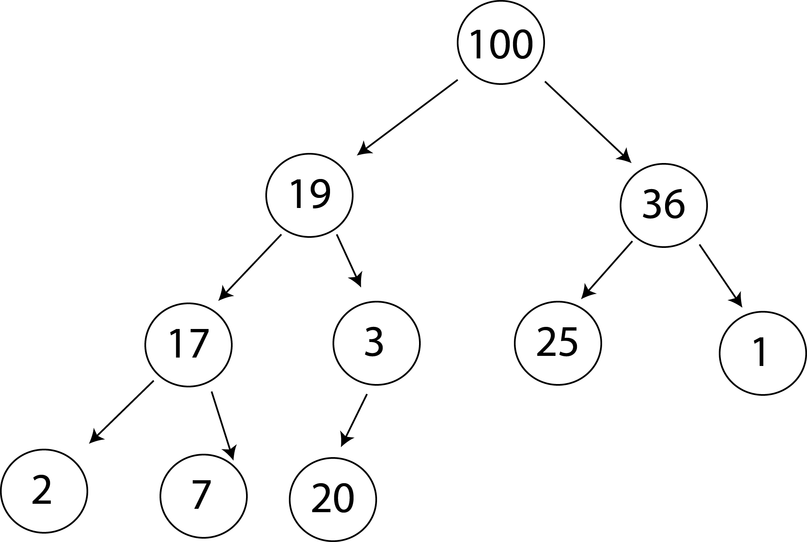
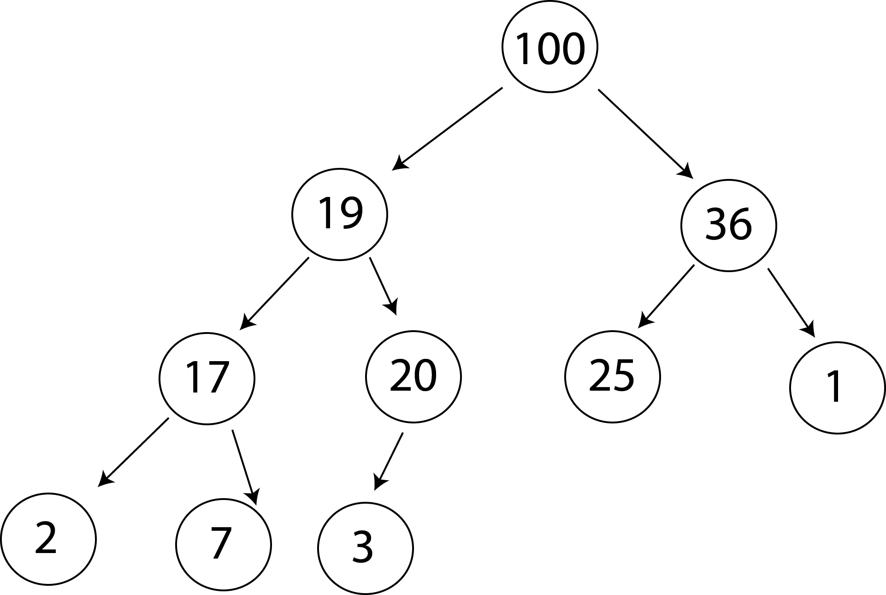

# Advanced Sorting and Disorder

On Day one of our algorithms elective, we'll focus on advanced topics in arrays.

# Sorting Algorithms

## Quick Sort

The idea of quick sort is simple:
1. Choose a number in the array. We will call this the pivot.
1. Reorder the array so that numbers less than or equal to the pivot are to the left of the pivot, and numbers greater than the pivot are on the right of the pivot.
1. Recursively repeat this process on the left side of the array (not including the pivot) and the right side of the array (also not including the pivot). We reach the base case when we try to sort an array with length less than or equal to one.

There are many variations of quick sort - they all share the approach outlined above, but differ in how they choose a pivot and reorder the array around the pivot.

Quick sort *typically* completes in O(n log(n)) time, and in most cases completes faster than other O(n log(n)) sorting algorithms. However, it performs very poorly in some cases, having a worst case time complexity of O(n2).

Quick Sorts are commonly divided into two parts. The main `quicksort` function implements the logic outlined above. A second helper function, called a partition function, chooses a pivot and reorders the array around the pivot. See below for details.

### partition functions
A partition function accepts three parameters:

1. `arr`: an array to reorganize.
1. `lo`: an integer representing an index in the array.
1. `hi`: also an integer representing an index in the array. The `hi` and `lo` parameters define the part of the array we want to reorganize.

A partition function will pick a pivot between indexes `lo` and `hi` (this is an *inclusive* range). Working in place, the partition function will reorder the array between (and including) indexes `lo` and `hi`, so that everything elements less than/equal to the pivot are on the left side of the pivot and elements larger than the pivot appear to the right of the pivot. The partition function should return the index of the pivot after reordering.

Partition functions should have time complexity O(hi - lo).

## Heap Sort

Heap sorting algorithms are closely connected to a data structure called a Max Binary Heap (Note that this has no relation to the "heap" we talk about in the context of memory management). Let's talk about this data structure.

### Max Binary Heap (MBH)

A max binary heap is a type of binary tree. Each node in the tree stores a value, as well as a left sub-tree and a right subtree. The left and right subtrees may be null. are familiar with, we guarantee that all values in the left subtree are smaller than or equal to the value of the root node, and we guarantee that all values in the right subtree are greater than the value of the root node.

In contrast, a max binary heap guarantees that all values in both the left and right subtree are less than or equal to the value of the root node. Therefore, the value of the root node in a max binary heap *must be the largest value in the heap*. Consider the heap below:

We can store it in an array like so: `[100, 19, 36, 17, 3, 25, 1, 2, 7]`. We store the root value in the 0th index of the array. Then we store the next level, `19` and `36` from left to right. Then we proceed to the next level, and so on.

### Building an MBH

Heap sort starts from the premise that we can interpret any array as if it were a heap. However, most arrays wont correspond to valid heaps. For instance, we would interpret the array `[1,2,4,3,7,6,5]` as the *invalid* heap:

.

To begin a heap sort, we first want to reorder an array so that it is a valid max binary heap. How do we do this? Let's start with a simpler question.

Suppose we have a valid heap, like our example earlier. `[100, 19, 36, 17, 3, 25, 1, 2, 7]`. If we add the number `20` to the end of this array, we will no longer have a valid heap. *Why is this no longer a valid heap?* Our new array, `[100, 19, 36, 17, 3, 25, 1, 2, 7, 20]`, corresponds to the heap:

Since `20 > 3`, we no longer have a valid heap. To fix this, we must "sift up" the value `20` until we have a valid heap again. We swap `20` with `3`:

Since `20 > 19` this is still an invalid heap. We have to sift `20` one level higher to obtain a valid heap.

Now that we know how to "sift up", we can turn any array into a valid MBH with these steps:

1. Consider the first element alone. It forms a valid MBH.
1. Consider the first two elements as an MBH, and sift up the last element. Now the first two elements for a valid MBH.
1. Consider the first three elements as an MBH, and sift up the last element. Now the first three elements form a valid MBH.
1. Continue iterating through the array, each time sifting up the current element.

### Sifting Down
Suppose, on the other hand, that we have a completely valid MBH except for the root node. We can turn it into a valid MBH by "sifting the root node down" to where it belongs, according to the following steps:

1. Find the larger of the two child nodes. If the larger of the two child nodes is larger than the root node, swap them.
1. Continue this until you hit the end of the heap or the value we are sifting down is larger than both its children.

### Overview of Heap Sort

1. Reorder the array so that it forms a valid MBH (buildMaxHeap)
1. Since we have a valid MBH, the first element must be the largest element in the array. Swap the first element with the last element.
1. We no longer consider the last element as part of the heap. The remaining heap may not be a valid MBH since the root was swapped with a different number. Sift down to obtain a valid MBH.
1. Now the first element in the array is the largest remaining element. Swap it with the last item in the heap.
1. No longer consider the last two elements in the array as part of the heap. We may not have a valid heap any longer, so we sift down.
1. Continue this process iteratively till we have a sorted array.

# Disorder

After launching Codesmith's CSX platform, we want to understand how people are using the site. There are a large number of coding challenges for users to work on, and the site recommends working on the coding challenges in a particular order. One question we have is - are our users actually completing the challenges in order? Are they starting with the hardest challenges and working backwards? Or are they skipping around randomly?

Luckily we're able to collect data on each user to see which order they are working on the challenges. For instance, our user Alice began working on challenge 2, then updated her code for challenge 2 again. Afterwards, she switched to working on challenge 4. Finding it difficult, she went backwards to begin challenge 3, and updated her code four times. We represent Alice's history of coding work with the array `[2,2,4,3,3,3,3]`.

How "in order" did Alice work on code? We are essentially looking for ways to measure the "sortedness", or *disorder* of an array. In the following challenges we will devise algorithms that compute measures of disorder.

## Inversions

Suppose we have an array of integers named `arr`. Then an inversion is a pair of indexes `(i,j)` such that `i < j` but `arr[i] > arr[j]`.

Create a function that counts the number of inversions in an array. (You should try to achieve this in O(n log(n)) time. Consider modifying a sorting algorithm (maybe another one that we haven't worked on today??) to count inversions as it sorts).

For example, `inversions([1,7,6,10,4,3])` should be `7` since `[1,7,6,10,4,3]` has `7` inversions (The pairs of indexes `(1,2), (1,4), (1,5), (2,4), (2,5), (3,4), (3,5)`).

## Longest Increasing Subsequence (LIS)

A subsequence of an array is a subarray where elements have the same order relative to the original array. (E.g. `[4,-1,10]` is a subsequence of `[1,4,-1,28,5,10]`, but `[-1,4,10]` is not).

An increasing subsequence (more accurately, a non-decreasing subsequence), is a subsequence of an array which is itself a sorted array. (E.g. `[1,4,28]` is an increasing subsequence of `[1,4,-1,28,5,10]` but `[4,-1,28]` isn't).

Write a function that returns the length of the longest possible increasing subsequence of an array. (Note that the longest increasing subsequence of an array may not be unique).

# Extensions

After completing the challenges above, work on these extensions to improve your code!

## Quick Sort Extensions

Look into different approaches to writing partition functions. In particular, write a Lomuto partition and a Hoare partition. Come up with examples of arrays that are sorted more efficiently using a Hoare partition. As a way of measuring the relative efficiency of the Lomuto and Hoare partition methods, add functionality into the `createSort` function to count the number of swaps made during sorting.

## Heap Sort Extension

The way we are building our max heap right now has time complexity O(n log(n)). Refactor your buildMaxHeap function so that it has time complexity O(n). See [this video](https://www.youtube.com/watch?v=MiyLo8adrWw) for guidance.

## Disorder Extensions

Extend your LIS function so that it also returns one of the (not necessarily unique) longest increasing subsequences.

Create your own measure of disorder that accounts for "skipping" numbers even if they are in order. For instance, we want the disorder of [1,4,7] to be higher than the disorder of [2,3,4] since 2, 3, and 4 are consecutive numbers.
